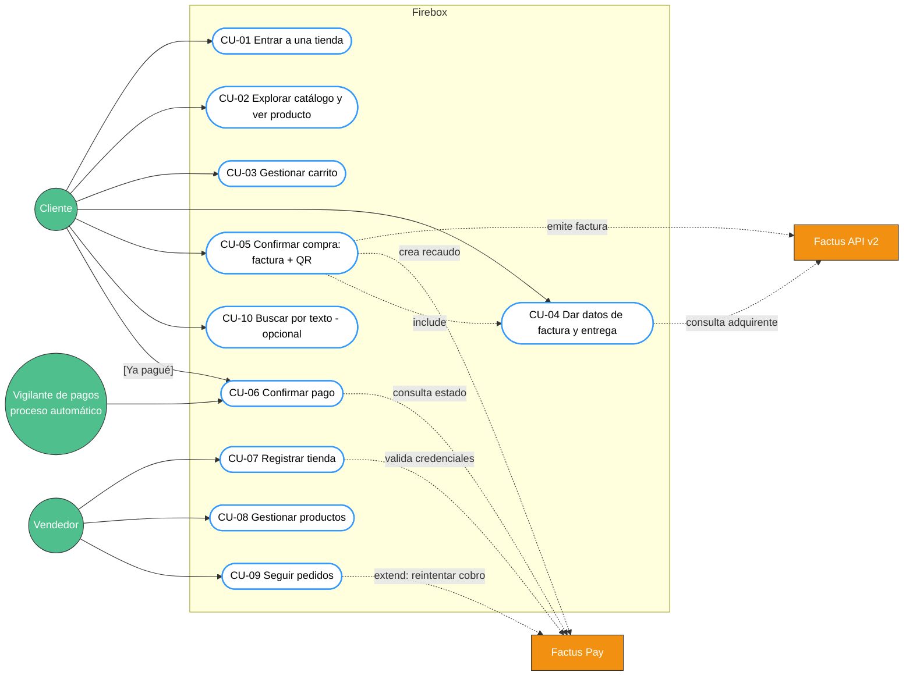

# CASOS DE USO DEL SISTEMA

**PROYECTO:** Firebox - tienda multi-negocio en WhatsApp con factura electrónica y QR de pago
**EQUIPO:** Equipo API WARS · **FECHA:** 05-oct-2026 · **VERSIÓN:** 1.0
**FUENTE:** `specs/001-tienda-whatsapp/spec.md` · Requisitos: `01_SRS_Especificacion_Requisitos.md`

---

## 1. DIAGRAMA DE CASOS DE USO

## 2. ACTORES

| Actor | Tipo | Descripción |
| --- | --- | --- |
| Cliente | Primario, humano | Compra por WhatsApp desde un número registrado (modo de prueba: máx. 5) |
| Vendedor | Primario, humano | Dueño de la tienda; usa el panel Laravel |
| Vigilante de pagos | Primario, sistema | Proceso de la API que cada 5 s consulta los cobros pendientes |
| Factus API v2 | Secundario, externo | Valida la factura ante la DIAN y entrega el PDF |
| Factus Pay | Secundario, externo | Crea recaudos con QR y reporta su estado |
| Meta Cloud API | Secundario, externo | Transporta los mensajes de WhatsApp (presente en todos los CU del cliente) |

---

## 3. ESPECIFICACIÓN DE CASOS DE USO

### CU-01 - Entrar a una tienda
- **Actor:** Cliente.
- **Descripción:** el cliente llega a la tienda por su enlace o código, o elige una de la lista.
- **Precondiciones:** el número del cliente está autorizado en el número de prueba de Meta; existe al menos una tienda activa.
- **Flujo principal:**
  1. El cliente abre `wa.me/<número>?text=TIENDA-RELOJES` y envía el mensaje.
  2. El sistema valida la firma del webhook, registra el `id` del mensaje y reconoce el código `RELOJES`.
  3. El sistema guarda la tienda actual en la conversación y envía: saludo con el nombre de la tienda + botón **[Ver catálogo]**.
- **Flujos alternos:**
  - 2a. Mensaje sin código y sin conversación previa → el sistema envía la lista de tiendas activas; el cliente elige una → paso 3.
  - 2b. Código inexistente o tienda inactiva → "No encontramos esa tienda" + lista de tiendas.
  - 2c. El cliente ya tenía carrito en otra tienda → "¿Abandonar tu carrito en «tienda»?" **[Sí, cambiar] [No, seguir]**.
  - 2d. Mensaje repetido por Meta (`id` ya registrado) → se ignora sin responder.
- **Postcondiciones:** conversación en estado `en_tienda` con la tienda elegida.
- **Requisitos:** RF-01, RF-02, RF-04.

### CU-02 - Explorar catálogo y ver producto
- **Actor:** Cliente.
- **Precondiciones:** conversación en `en_tienda` o posterior.
- **Flujo principal:**
  1. El cliente pulsa **[Ver catálogo]**.
  2. El sistema envía una lista interactiva con las categorías de la tienda.
  3. El cliente elige una categoría; el sistema envía una lista con hasta 10 productos (título ≤ 24, descripción ≤ 72 con precio con IVA).
  4. El cliente elige un producto; el sistema envía un mensaje de botones con la **foto como encabezado**, nombre, precio con IVA y
     **[Agregar] [Ver otro] [Ver carrito]**.
- **Flujos alternos:**
  - 2a. La tienda no tiene categorías → se salta al paso 3 con todos los productos.
  - 3a. Más de 10 productos → la última fila es "Ver más ▸" (página siguiente).
  - 4a. La foto falla al enviarse → se envía el mismo contenido como texto con los botones.
- **Postcondiciones:** conversación en `viendo_producto`.
- **Requisitos:** RF-03, RF-05, RF-06.

### CU-03 - Gestionar carrito
- **Actor:** Cliente.
- **Flujo principal:**
  1. El cliente pulsa **[Agregar]**; el sistema pregunta la cantidad **[1] [2] [3]** (o escribir de 1 a 20).
  2. El cliente elige la cantidad; el sistema agrega la línea, recalcula y confirma: "Agregado: 2 × Reloj 8314. Total parcial $404.362".
  3. El cliente pulsa **[Ver carrito]**; el sistema muestra cada línea, subtotal sin IVA, IVA y total con **[Pagar] [Seguir comprando]
     [Vaciar]**.
- **Flujos alternos:**
  - 1a. Cantidad escrita fuera de 1-20 o no numérica → se repite la pregunta.
  - 3a. **[Vaciar]** → carrito vacío y saludo de la tienda.
  - 3b. Producto desactivado por el vendedor mientras estaba en el carrito → se retira al ver el carrito y se avisa.
  - *. El cliente escribe `cancelar` → se vacía el carrito; `carrito` → paso 3; `menu` → saludo de la tienda.
- **Postcondiciones:** carrito persistido en la conversación con totales calculados por el motor de impuestos.
- **Requisitos:** RF-07, RF-08, RF-27.

### CU-04 - Dar datos de factura y entrega
- **Actor:** Cliente. **Secundario:** Factus API v2.
- **Precondiciones:** carrito no vacío.
- **Flujo principal:**
  1. El cliente pulsa **[Pagar]**; el sistema verifica que el total esté entre $10.000 y $12.000.000.
  2. El sistema pregunta **[Factura a mi nombre] [Consumidor final]**; el cliente elige "a mi nombre".
  3. El sistema pide tipo y número de documento; el cliente escribe "CC 1000000000".
  4. El sistema consulta `GET /v2/dian/acquirer`; si existe, pregunta "¿Eres Juan Pérez, j***@gmail.com?" **[Sí] [Corregir]**; el
     cliente confirma.
  5. El sistema pregunta **[Recojo en tienda] [Envío a domicilio]**; el cliente elige.
- **Flujos alternos:**
  - 1a. Total fuera de rango → mensaje con el rango permitido; vuelve al carrito; no se factura.
  - 2a. **[Consumidor final]** → se omiten los pasos 3-4.
  - 4a. Factus responde 404 → el sistema pide nombre completo y luego correo (validado).
  - 4b. **[Corregir]** → el sistema pide nombre y correo a mano.
  - 5a. **[Envío a domicilio]** → el sistema pide la dirección (5-200 caracteres) y aclara que el envío se coordina por fuera.
- **Postcondiciones:** conversación en `confirmando` con datos de factura y entrega completos.
- **Requisitos:** RF-09, RF-10, RF-11, RF-12.

### CU-05 - Confirmar compra: factura + QR
- **Actor:** Cliente. **Secundarios:** Factus API v2, Factus Pay.
- **Precondiciones:** CU-04 completo.
- **Flujo principal:**
  1. El sistema muestra el resumen (productos, total, datos de factura, entrega) con **[Confirmar compra] [Cancelar]**.
  2. El cliente pulsa **[Confirmar compra]**.
  3. El sistema recalcula con precios vigentes, crea el pedido con copia fija de las líneas y lo pasa a `facturando`.
  4. El sistema emite la factura (`POST /v2/bills/validate`, `reference_code = FB-<TIENDA>-<id>`), recibe número y CUFE, y verifica que
     el total de Factus sea igual al calculado. Estado `facturado`.
  5. El sistema descarga el PDF de la factura.
  6. El sistema crea el recaudo en Factus Pay (referencia = número de factura, monto = total) y recibe el QR.
  7. El sistema arma un PDF: factura + página "Paga aquí" (tienda, número, total, QR, referencia, vencimiento 24 h, instrucciones).
  8. El sistema sube y envía por WhatsApp: texto "Tu factura SETP… está lista", el PDF, la imagen del QR y las instrucciones con
     **[Ya pagué]**. Estado `cobro_pendiente`.
- **Flujos alternos:**
  - 2a. Doble clic → el segundo clic encuentra el pedido en `facturando`/`facturado` y responde con el estado, sin facturar de nuevo.
  - 3a. Un precio cambió → se muestra el resumen actualizado y se pide confirmar otra vez.
  - 4a. Factus 422 → `error_factura`, mensaje amable al cliente, evento con el detalle para el panel; fin.
  - 4b. Factus 5xx o sin red → 3 reintentos (1 s, 2 s, 4 s); si persiste → 4a.
  - 4c. Total de Factus ≠ total calculado → `error_factura` ("diferencia de totales"); no se cobra.
  - 6a. Factus Pay falla tras 3 reintentos → `error_cobro`; se envía la factura sin QR y el vendedor ve **[Reintentar cobro]**.
  - 6b. El recaudo llega con `qr: null` → se consulta `GET /v1/collections/{ref}` hasta 3 veces.
- **Postcondiciones:** pedido `cobro_pendiente` con factura validada, recaudo `ready` y documentos enviados.
- **Requisitos:** RF-13, RF-14, RF-15, RF-16.

### CU-06 - Confirmar pago
- **Actores:** Vigilante de pagos (principal) y Cliente (con **[Ya pagué]**). **Secundario:** Factus Pay.
- **Precondiciones:** pedido en `cobro_pendiente`.
- **Flujo principal:**
  1. Cada 5 s el vigilante consulta `GET /v1/collections/{referencia}` por cada pedido pendiente.
  2. Factus Pay responde `paid`.
  3. El sistema actualiza el pedido a `pagado` **solo si seguía en `cobro_pendiente`** y registra la hora.
  4. Si la actualización cambió la fila, envía "✅ Pago recibido. Tu factura SETP… quedó pagada" y registra el evento.
- **Flujos alternos:**
  - 1a. El cliente pulsa **[Ya pagué]** → la consulta se hace en ese momento; si no está pagado: "Aún no vemos el pago; puede tardar unos
    segundos".
  - 2a. `ready` con más de 24 h → `vencido`; se deja de consultar.
  - 3a. Otra consulta ya lo marcó `pagado` → no se envía un segundo mensaje.
  - 4a. Fuera de la ventana de 24 h de WhatsApp (error `131047`) → evento en el panel; sin reintento.
- **Postcondiciones:** pedido `pagado` (o `vencido`), cliente notificado una sola vez.
- **Requisitos:** RF-17, RF-18, RF-19.

### CU-07 - Registrar tienda
- **Actor:** Vendedor. **Secundario:** Factus Pay.
- **Flujo principal:**
  1. El vendedor abre el panel y elige "Crear mi tienda".
  2. Ingresa nombre, NIT, correo, código corto (3-20, letras y números), contraseña del panel y correo/contraseña de Factus Pay.
  3. Laravel envía `POST /api/v1/tiendas` a la API.
  4. La API valida el código único, prueba las credenciales en Factus Pay (`POST /auth`), cifra las credenciales y el token, y crea la
     tienda.
  5. La API devuelve el token del panel y el enlace `https://wa.me/<número>?text=TIENDA-<CÓDIGO>`; Laravel guarda el token en la sesión
     y muestra el enlace con botón de copiar.
- **Flujos alternos:**
  - 4a. Código ya usado → 409 "Ese código ya existe".
  - 4b. Credenciales de Factus Pay inválidas → 422 "No pudimos conectar con tu cuenta de Factus Pay"; no se guarda nada.
- **Postcondiciones:** tienda activa, sin productos.
- **Requisitos:** RF-20.

### CU-08 - Gestionar productos
- **Actor:** Vendedor.
- **Precondiciones:** sesión iniciada (token de tienda).
- **Flujo principal:**
  1. El vendedor abre "Productos" y pulsa "Nuevo".
  2. Ingresa nombre, categoría, precio **sin IVA**, tarifa (19 %, 5 %, 0 % exento, excluido) y foto (JPG/PNG ≤ 5 MB).
  3. La API valida, guarda y devuelve el producto con su **precio con IVA** calculado.
  4. El panel lo muestra en la lista.
- **Flujos alternos:**
  - 2a. Foto > 5 MB o de otro tipo → rechazo en el panel.
  - 3a. Precio ≤ 0 o tarifa inválida → 422 con el campo.
  - A. Editar → `PATCH`; los pedidos anteriores conservan su copia fija.
  - B. Desactivar → deja de verse en WhatsApp.
  - C. Importar CSV → la API crea las filas válidas y devuelve el reporte de las rechazadas.
- **Postcondiciones:** catálogo actualizado y visible en WhatsApp de inmediato.
- **Requisitos:** RF-21, RF-22.

### CU-09 - Seguir pedidos
- **Actor:** Vendedor. **Secundario:** Factus Pay (en reintento de cobro).
- **Flujo principal:**
  1. El vendedor abre "Pedidos"; Livewire consulta `GET /api/v1/pedidos` cada 5 s.
  2. El panel muestra cada pedido con fecha, cliente, total, estado (color), número de factura y enlace al PDF.
  3. El vendedor abre un pedido y ve la línea de tiempo de eventos.
- **Flujos alternos:**
  - 3a. Pedido en `error_cobro` → **[Reintentar cobro]** → `POST /api/v1/pedidos/{id}/reintentar-cobro` → si funciona, el cliente recibe
    el QR.
  - 3b. Pedido en `error_factura` → el panel muestra el detalle de Factus para corregir (p. ej. el producto).
- **Postcondiciones:** ninguna (consulta), salvo el reintento.
- **Requisitos:** RF-23, RF-24, RF-25, RF-26.

### CU-10 - Buscar por texto (opcional)
- **Actor:** Cliente.
- **Flujo principal:** el cliente escribe "reloj dorado mujer"; el sistema busca por nombre, categoría y color y responde con una lista
  de hasta 10 productos con precios **leídos de la base de datos**.
- **Flujo alterno:** sin resultados → "No encontré eso" + **[Ver catálogo]**.
- **Requisitos:** RF-28.

## 4. CONCLUSIÓN

Los diez casos de uso cubren las siete historias de `spec.md` y sus 28 requisitos funcionales. Los casos CU-05 y CU-06 concentran las
tres integraciones externas y los candados de idempotencia; por eso sus flujos alternos están descritos con el mayor detalle.
