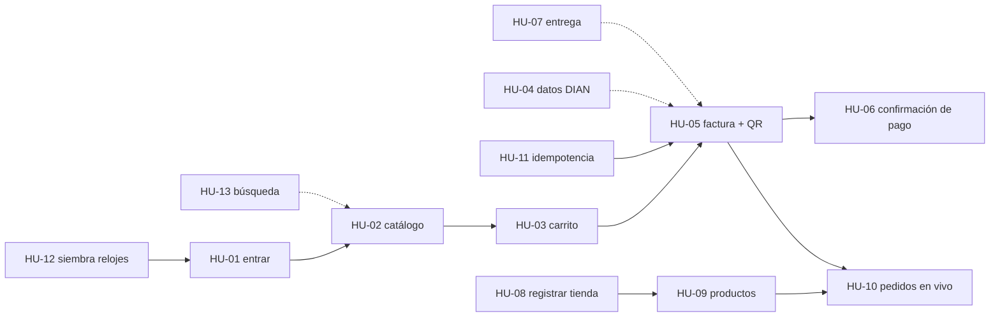

# HISTORIAS DE USUARIO

**PROYECTO:** Firebox · **EQUIPO:** Equipo API WARS · **FECHA:** 05-oct-2026 · **VERSIÓN:** 1.0
**FUENTE:** `specs/001-tienda-whatsapp/spec.md` (los criterios completos Dado/Cuando/Entonces están allí)

---

## 1. FORMATO

Cada historia sigue: **Como** «rol» **quiero** «acción» **para** «beneficio». Se estima en horas de trabajo de la hackathon y se asigna a
una de las cuatro líneas de trabajo:

| Línea | Qué construye | Perfil |
| --- | --- | --- |
| **L1 Canal y conversación** | Webhook de Meta, adaptador de envío, máquina de estados del chat | Python |
| **L2 Facturación y documento** | Motor de impuestos, cliente Factus v2, PDF "factura + paga aquí" | Python |
| **L3 Pagos y vigilante** | Cliente Factus Pay, vigilante, idempotencia, reintentos | Python |
| **L4 Panel** | Laravel + Livewire consumiendo la API | PHP/Laravel |

La API REST del panel (endpoints de tiendas, productos y pedidos) la construye L3 junto con el modelo de datos, porque es la línea con
menos trabajo de integración al inicio.

## 2. HISTORIAS

| Id | Historia | Prioridad | Estimación | Línea | Criterios clave (resumen) |
| --- | --- | --- | --- | --- | --- |
| HU-01 | **Como** cliente **quiero** entrar a una tienda con su enlace **para** comprar ahí sin buscarla | Alta | 1 h | L1 | `TIENDA-RELOJES` → saludo + [Ver catálogo]; sin código → lista de tiendas |
| HU-02 | **Como** cliente **quiero** ver el catálogo por categorías con fotos y precios con IVA **para** elegir qué comprar | Alta | 2 h | L1 | Listas ≤ 10 filas con "Ver más"; tarjeta con foto + 3 botones |
| HU-03 | **Como** cliente **quiero** un carrito con totales exactos **para** saber cuánto voy a pagar | Alta | 2 h | L1 + L2 | Cantidad 1-20; subtotal, IVA, total half-even; [Pagar] [Seguir] [Vaciar] |
| HU-04 | **Como** cliente **quiero** facturar a mi nombre sin escribir todo **para** terminar rápido | Media | 1,5 h | L2 | Consulta DIAN vía Factus; 404 → datos a mano; consumidor final |
| HU-05 | **Como** cliente **quiero** recibir mi factura electrónica con el QR de pago en el chat **para** tener soporte y pagar en un paso | Alta | 3 h | L2 + L3 | Factura validada (CUFE), recaudo ref = número factura, PDF combinado + PNG del QR |
| HU-06 | **Como** cliente **quiero** que me confirmen el pago solos **para** no mandar comprobantes | Alta | 2 h | L3 | ≤ 10 s tras pagar; un solo mensaje; [Ya pagué]; vencido a 24 h |
| HU-07 | **Como** cliente **quiero** decir si recojo o me envían **para** que el negocio sepa qué hacer | Media | 0,5 h | L1 | Dirección 5-200 caracteres; envío sin costo en v1 |
| HU-08 | **Como** vendedor **quiero** registrar mi tienda **para** tener mi enlace de WhatsApp | Alta | 2 h | L3 + L4 | Valida Factus Pay; cifra credenciales; devuelve token + enlace `wa.me` |
| HU-09 | **Como** vendedor **quiero** cargar mis productos con foto e IVA **para** que aparezcan en WhatsApp | Alta | 2,5 h | L3 + L4 | CRUD; precio con IVA calculado por la API; desactivar; CSV (P2) |
| HU-10 | **Como** vendedor **quiero** ver mis pedidos cambiar a pagado en vivo **para** saber qué despachar | Media | 2 h | L4 | `wire:poll.5s`; línea de tiempo; [Reintentar cobro]; resumen del día |
| HU-11 | **Como** equipo **queremos** que un mensaje repetido no cree dos facturas **para** no duplicar documentos fiscales | Alta | 1 h | L1 + L3 | 10 webhooks iguales → 1 pedido, 1 factura, 1 recaudo |
| HU-12 | **Como** equipo **queremos** cargar los 74 relojes de NovaMarket **para** tener una tienda real en la demo | Alta | 1 h | L3 | Script de siembra desde `catalogo_tienda.json` con fotos |
| HU-13 | **Como** cliente **quiero** buscar escribiendo **para** no recorrer todo el catálogo | Baja | 1,5 h | L1 | Opcional; precios siempre de la base de datos |

**Total estimado:** 22,5 h de trabajo ≈ 5,5-6 h de reloj con 4 personas en paralelo, más integración, despliegue y pitch.

## 3. ORDEN DE ENTREGA (camino crítico de la demo)

Línea continua = imprescindible para la demo. Línea punteada = suma valor pero la demo funciona sin ella.

## 4. DEFINICIÓN DE TERMINADO (para cada historia)

1. Cumple sus escenarios de `spec.md`.
2. Tiene pruebas, y las de reglas críticas con control negativo (`DETECTA el bug`).
3. Revisada por otro integrante (pull request a `main`).
4. Funciona en el ambiente desplegado.
5. Evidencia guardada en `docs/documentacion/evidencias/<HU>/` (pantallazo o salida del comando).
