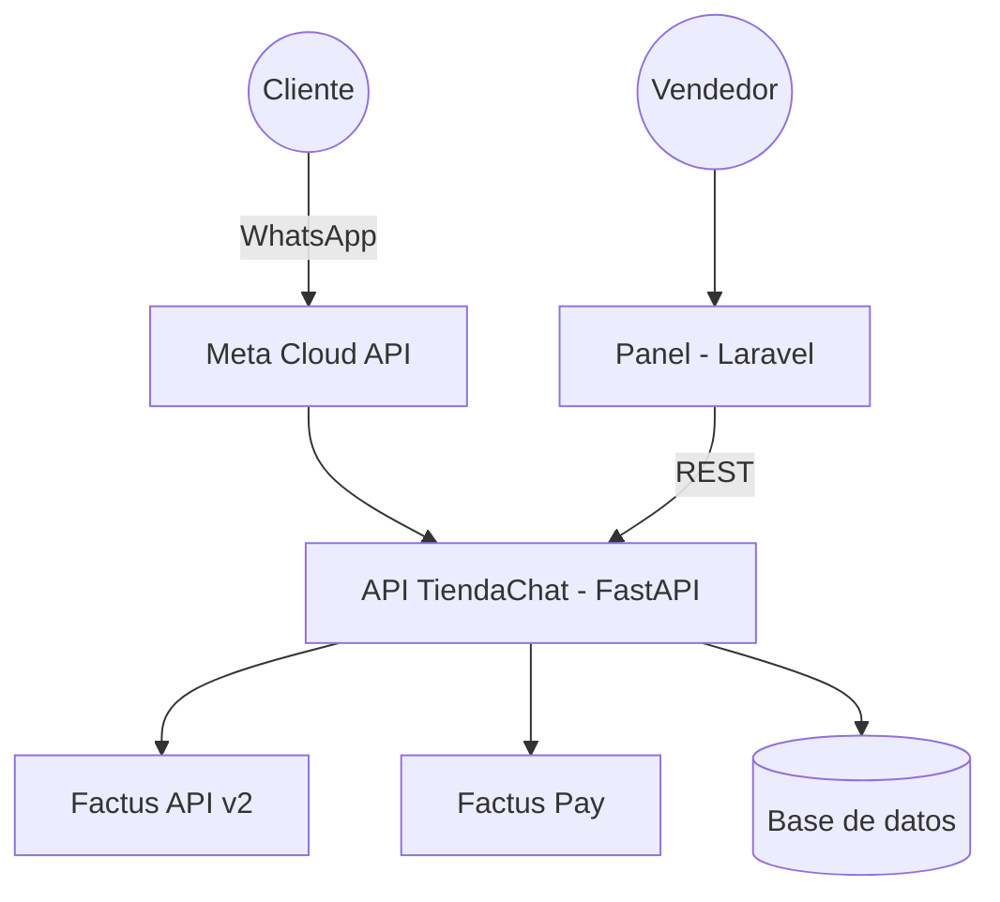

# DOCUMENTO DE ESPECIFICACIÓN DE REQUISITOS DE SOFTWARE (SRS)

**EQUIVALENTE SENA:** Fase de Análisis - Especificación de requisitos (mismo formato que `SENA/proyecto p2p/SRS_P2P_Manager.docx`,
ampliado según IEEE 830)
**PROYECTO:** TiendaChat - tienda multi-negocio en WhatsApp con factura electrónica (Factus) y QR de pago (Factus Pay)
**EQUIPO:** Equipo API WARS (integrantes en `RETO.md`) · Líder técnico: Fernando Vega Benavides
**PROGRAMA DE REFERENCIA:** Análisis y Desarrollo de Software (ADSO)
**EVENTO:** API WARS Hackathon 2026 - Universidad Distrital, Facultad Tecnológica · **FECHA:** 05-oct-2026 · **VERSIÓN:** 1.0
**FUENTE:** `specs/001-tienda-whatsapp/spec.md` (especificación SDD). Si hay diferencia, se corrige aquí para que coincida con la spec.

---

## 1. INTRODUCCIÓN

### 1.1 Propósito
Definir los requisitos funcionales y no funcionales de TiendaChat, una plataforma que permite a varios negocios vender por WhatsApp,
emitir la factura electrónica de cada venta y cobrarla con un QR Bre-B, para que el equipo de desarrollo, los evaluadores de la
hackathon y cualquier lector técnico entiendan qué hace el sistema y cómo se acepta.

### 1.2 Alcance
TiendaChat permitirá:
- a un **vendedor**, registrar su negocio y su catálogo en un panel web y obtener un enlace de WhatsApp para su tienda;
- a un **cliente**, ver el catálogo, armar un carrito, recibir la **factura electrónica validada por la DIAN** con su **QR de pago** en el
  mismo chat, pagar, y recibir la confirmación automática;
- al **vendedor**, seguir cada pedido de *facturado* a *pagado* en tiempo real.

No incluye logística de envío, inventario, devoluciones ni anulación automática de facturas (ver §2.6).

### 1.3 Definiciones, acrónimos y abreviaturas

| Término | Definición |
| --- | --- |
| API | Interfaz de programación de aplicaciones; aquí, el servicio FastAPI propio y las APIs externas |
| Bre-B | Sistema de pagos inmediatos del Banco de la República de Colombia, basado en "llaves" |
| CUFE | Código Único de Factura Electrónica asignado al validar ante la DIAN |
| DIAN | Dirección de Impuestos y Aduanas Nacionales |
| Factus | Proveedor de facturación electrónica (API v2) |
| Factus Pay | Pasarela de recaudos con QR Bre-B de Factus |
| Recaudo | Cobro creado en Factus Pay, con referencia y monto, que genera un QR |
| Sandbox | Ambiente de pruebas sin validez fiscal ni movimiento de dinero real |
| Webhook | Llamada HTTP que un sistema externo hace a nuestra API cuando ocurre un evento |
| Consumidor final | Comprador que no se identifica en la factura |
| SDD | Spec-Driven Development: especificación → plan → tareas → código |
| RF / RNF | Requisito funcional / no funcional |

### 1.4 Referencias
- Constitución del proyecto: `.specify/memory/constitution.md`.
- Especificación SDD: `specs/001-tienda-whatsapp/spec.md`.
- Integraciones y conexiones: `docs/sena/07_Integraciones_Conexiones.md`.
- Factus API v2: `https://developers.factus.com.co` y skill oficial `.claude/skills/facturas-crear-y-validar/SKILL.md`.
- Factus Pay: `https://pay-developers.factus.com.co` y `docs/factus-pay/FACTUS-PAY-ANALISIS-2026-09-25.md`.
- WhatsApp Cloud API: `https://developers.facebook.com/docs/whatsapp/cloud-api`.
- IEEE Std 830-1998, Recommended Practice for Software Requirements Specifications.

### 1.5 Visión general del documento
La sección 2 describe el producto en general; la sección 3 lista los requisitos específicos; la sección 4 da los criterios de
aceptación; la sección 5 cruza requisitos con historias y casos de uso.

---

## 2. DESCRIPCIÓN GENERAL

### 2.1 Perspectiva del producto
Sistema nuevo compuesto por dos aplicaciones propias y tres servicios externos:

### 2.2 Funciones del producto
1. Gestión de tiendas (registro, acceso, enlace de WhatsApp).
2. Gestión de catálogo (productos, categorías, IVA, fotos, carga CSV).
3. Conversación de compra en WhatsApp (catálogo, producto, carrito).
4. Facturación electrónica (datos del adquirente, emisión, validación, PDF).
5. Cobro con QR (recaudo, documento "factura + paga aquí").
6. Confirmación de pago (vigilante, mensaje al cliente).
7. Seguimiento de pedidos en vivo (panel, línea de tiempo, resumen del día).

### 2.3 Características de los usuarios

| Usuario | Conocimiento técnico | Necesidad principal |
| --- | --- | --- |
| Cliente | Usa WhatsApp; no instala nada | Comprar y pagar rápido, recibir su factura |
| Vendedor | Básico (navegador web) | Vender sin programar y saber quién pagó |
| Equipo técnico | Python, Laravel | Mantener e integrar |

### 2.4 Restricciones
- WhatsApp solo por la API oficial de Meta (Cloud API v25.0); en modo de prueba, máximo 5 destinatarios.
- Facturación solo con Factus API v2 (sandbox compartido durante la hackathon).
- Cobro solo con Factus Pay (monto entre $10.000 y $12.000.000 por recaudo).
- Lenguajes: Python (API) y PHP/Laravel (panel). Base de datos relacional.
- Plazo: más de 8 horas de construcción durante la hackathon.

### 2.5 Suposiciones y dependencias
- Las credenciales de sandbox de Factus v2 y Factus Pay siguen activas durante el evento (verificadas el 05-oct-2026).
- Meta permite crear la app y el número de prueba el día del evento.
- Hay conexión a internet estable para la demo (riesgo observado: el hotspot del líder se cayó 7 veces en 11 minutos; se usa la red de
  otro integrante).

### 2.6 Fuera de alcance (v1)
Envíos y su costo, inventario, devoluciones, nota crédito automática, otras pasarelas, otras monedas, mensajes iniciados por la tienda
(plantillas), un número de WhatsApp por tienda, app móvil, varios usuarios por tienda.

---

## 3. REQUISITOS ESPECÍFICOS

### 3.1 Requisitos funcionales (RF)

| Id | Requisito | Prioridad | Origen (spec) |
| --- | --- | --- | --- |
| RF-01 | El sistema debe recibir mensajes de WhatsApp por webhook verificado con firma HMAC y responder a Meta en menos de 2 s. | Alta | FR-001..003 |
| RF-02 | El sistema debe procesar cada mensaje de WhatsApp una sola vez aunque Meta lo reenvíe. | Alta | FR-004 |
| RF-03 | El sistema debe enviar texto, listas, botones (con foto), imágenes y PDF por WhatsApp respetando los límites de Meta. | Alta | FR-005, FR-006 |
| RF-04 | El sistema debe identificar la tienda por el código `TIENDA-<CÓDIGO>` o mostrar la lista de tiendas si no hay código. | Alta | FR-013 |
| RF-05 | El sistema debe mostrar el catálogo activo de la tienda por categorías, de 10 en 10. | Alta | FR-020 |
| RF-06 | El sistema debe mostrar cada producto con foto, nombre, precio con IVA y botones [Agregar] [Ver otro] [Ver carrito]. | Alta | US1-4 |
| RF-07 | El sistema debe gestionar un carrito por cliente con cantidades de 1 a 20 y recalcular totales en cada cambio. | Alta | FR-021 |
| RF-08 | El sistema debe calcular subtotal, IVA y total por línea con redondeo bancario (half-even) y sin usar números flotantes. | Alta | FR-022 |
| RF-09 | El sistema debe validar que el total esté entre $10.000 y $12.000.000 antes de facturar. | Alta | FR-042 |
| RF-10 | El sistema debe permitir facturar a nombre del cliente o como consumidor final. | Alta | US2-1 |
| RF-11 | El sistema debe consultar al adquirente en la DIAN (vía Factus) para autocompletar nombre y correo, y pedirlos a mano si no existe. | Media | FR-034 |
| RF-12 | El sistema debe preguntar la forma de entrega (recoger o envío) y guardar la dirección cuando aplique. | Media | US6 |
| RF-13 | El sistema debe emitir y validar la factura electrónica en Factus v2 con referencia única por pedido. | Alta | FR-030..033 |
| RF-14 | El sistema debe comprobar que el total devuelto por Factus sea igual al total calculado; si no, detener el pedido. | Alta | FR-035 |
| RF-15 | El sistema debe crear un recaudo en Factus Pay con referencia = número de factura y monto = total de la factura. | Alta | FR-040, FR-041 |
| RF-16 | El sistema debe enviar al cliente un único PDF con la factura y una página "Paga aquí" con el QR, más la imagen del QR. | Alta | FR-050, FR-051 |
| RF-17 | El sistema debe consultar cada 5 s los cobros pendientes y marcar el pedido como pagado o vencido (24 h). | Alta | FR-043 |
| RF-18 | El sistema debe enviar una sola confirmación de pago por pedido. | Alta | FR-044 |
| RF-19 | El sistema debe permitir al cliente consultar el pago con [Ya pagué]. | Media | US3-3 |
| RF-20 | El sistema debe permitir registrar una tienda validando sus credenciales de Factus Pay y entregar su enlace `wa.me`. | Alta | US4-1, US4-2 |
| RF-21 | El sistema debe permitir crear, editar, desactivar y listar productos con foto e IVA. | Alta | US4-3, US4-4 |
| RF-22 | El sistema debe permitir cargar productos desde CSV con reporte de errores por fila. | Media | US4-5 |
| RF-23 | El sistema debe mostrar al vendedor sus pedidos actualizados cada 5 s sin recargar. | Media | FR-062 |
| RF-24 | El sistema debe mostrar la línea de tiempo de eventos de cada pedido. | Media | FR-080 |
| RF-25 | El sistema debe permitir reintentar el cobro de un pedido en `error_cobro`. | Media | US5-3 |
| RF-26 | El sistema debe mostrar el resumen del día (pedidos, facturado, pagado). | Baja | US5-4 |
| RF-27 | El sistema debe aceptar `cancelar`, `menu` y `carrito` en cualquier paso previo a confirmar. | Media | FR-012 |
| RF-28 | (Opcional) El sistema debe buscar productos por texto libre sin que la IA fije precios. | Baja | US7 |

### 3.2 Requisitos no funcionales (RNF)

| Id | Categoría | Requisito | Cómo se mide |
| --- | --- | --- | --- |
| RNF-01 | Rendimiento | De [Confirmar compra] a recibir PDF y QR: ≤ 15 s en sandbox. | Cronómetro en 5 compras (SC-002) |
| RNF-02 | Rendimiento | De pago simulado a confirmación en WhatsApp: ≤ 10 s. | SC-003 |
| RNF-03 | Exactitud | 0 diferencias entre total calculado, total de Factus y monto del recaudo. | 20 compras de prueba (SC-004) |
| RNF-04 | Confiabilidad | Idempotencia: 10 webhooks iguales → 1 pedido, 1 factura, 1 recaudo. | SC-005 |
| RNF-05 | Seguridad | Credenciales cifradas (Fernet); ningún secreto en repositorio, panel, logs ni respuestas. | Revisión + búsqueda en el repositorio |
| RNF-06 | Seguridad | Webhooks con firma inválida rechazados (401). | Prueba con firma alterada |
| RNF-07 | Seguridad | Aislamiento multi-tienda: un token solo ve datos de su tienda. | Prueba con token ajeno |
| RNF-08 | Usabilidad | Compra completa (1 producto, consumidor final) en ≤ 3 min y ≤ 15 toques; mensajes en español claro. | SC-001 |
| RNF-09 | Usabilidad | Registro de tienda + 3 productos en ≤ 5 min. | SC-006 |
| RNF-10 | Mantenibilidad | Canal de WhatsApp aislado en un adaptador; API documentada en OpenAPI. | Revisión de código, `/docs` |
| RNF-11 | Portabilidad | Arranca con `docker-compose up` en cualquier equipo con Docker. | Prueba en una máquina limpia |
| RNF-12 | Calidad | Pruebas de reglas críticas con control negativo registrado. | SC-008 |
| RNF-13 | Compatibilidad | Toda llamada a Factus envía `User-Agent` propio. | Prueba sin User-Agent → 403 |

---

## 4. CRITERIOS DE ACEPTACIÓN

Un módulo se acepta cuando:
1. cumple el 100 % de sus RF de prioridad Alta y sus escenarios Dado/Cuando/Entonces de `spec.md`;
2. sus pruebas pasan **y** cada prueba crítica tiene control negativo (`DETECTA el bug`);
3. funciona en la URL desplegada (no solo en localhost), probado dos veces seguidas;
4. su evidencia (pantallazo o salida de comando) queda en `docs/sena/evidencias/`.

El sistema completo se acepta cuando se cumplen SC-001 a SC-008 de `spec.md`.

## 5. MATRIZ DE TRAZABILIDAD

| Historia (spec) | Casos de uso (`02_Casos_de_Uso.md`) | Requisitos |
| --- | --- | --- |
| US1 Comprar en el chat | CU-01, CU-02, CU-03 | RF-01..08, RF-27 |
| US2 Factura con QR | CU-04, CU-05 | RF-09..16 |
| US3 Pagar y confirmar | CU-06 | RF-17..19 |
| US4 Registrar tienda y catálogo | CU-07, CU-08 | RF-20..22 |
| US5 Seguir pedidos | CU-09 | RF-23..26 |
| US6 Entrega | CU-04 | RF-12 |
| US7 Búsqueda (opcional) | CU-10 | RF-28 |
