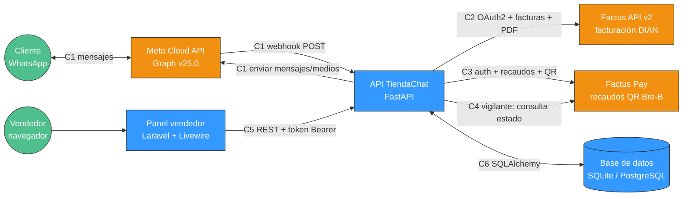
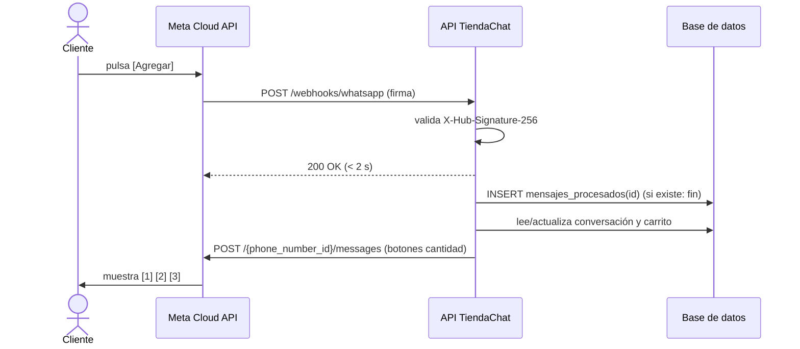
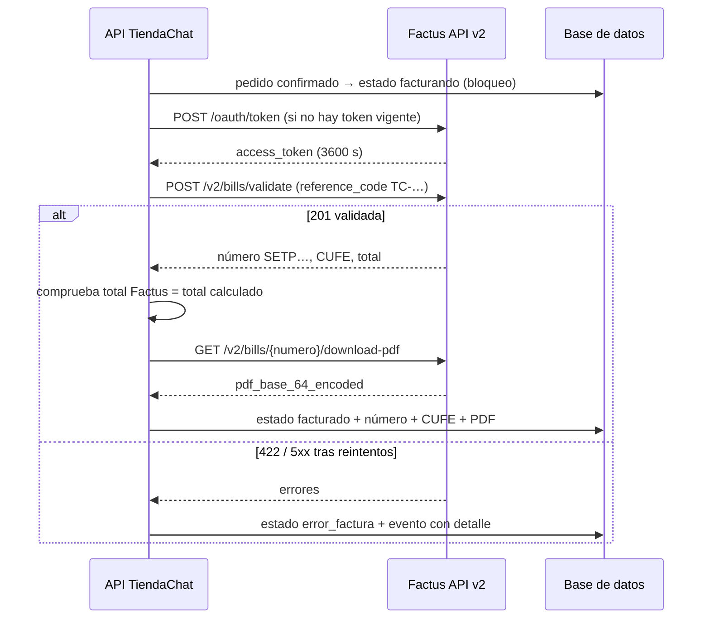
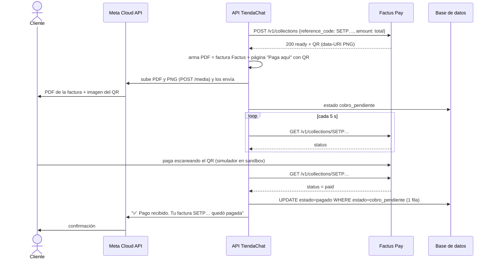

# DOCUMENTACIÓN DE INTEGRACIONES Y CONEXIONES DEL SISTEMA

**EQUIVALENTE SENA:** Diseño y desarrollo de servicios web / API del proyecto (GA7-220501096-AA5-EV02 y AA5-EV04)
**PROYECTO:** TiendaChat - tienda multi-negocio en WhatsApp con factura electrónica (Factus) y QR de pago (Factus Pay)
**EQUIPO:** Equipo API WARS (integrantes en `RETO.md`) · Líder técnico: Fernando Vega Benavides
**EVENTO:** API WARS Hackathon 2026 - Universidad Distrital Francisco José de Caldas, Facultad Tecnológica
**FECHA:** 05-oct-2026 · **VERSIÓN:** 1.0
**FUENTE DE REQUISITOS:** `specs/001-tienda-whatsapp/spec.md` · **REGLAS:** `.specify/memory/constitution.md`

---

## 1. INTRODUCCIÓN

Este documento describe, conexión por conexión, cómo se comunica TiendaChat con cada sistema: qué hace cada conexión, con qué
credenciales, qué endpoints usa, qué envía y qué recibe, qué errores puede devolver, qué límites tiene, y **qué se verificó en vivo**
contra los ambientes de prueba el 05-oct-2026. Cada dato marcado ✅ fue medido; cada dato marcado 📄 viene de la documentación oficial y
se verifica durante la implementación.

## 2. MAPA GENERAL DE CONEXIONES



| Id | Conexión | Dirección | Protocolo | Autenticación |
| --- | --- | --- | --- | --- |
| C1 | WhatsApp (Meta Cloud API) | entrada (webhook) y salida | HTTPS JSON | Firma HMAC `X-Hub-Signature-256` (entrada) · Bearer token de sistema (salida) |
| C2 | Factus API v2 | salida | HTTPS, form-urlencoded (token) y JSON | OAuth2 `password` + `refresh_token` |
| C3 | Factus Pay (crear recaudo) | salida | HTTPS JSON | `POST /auth` → token Bearer que no vence |
| C4 | Factus Pay (vigilante de pagos) | salida, periódica | HTTPS JSON | el mismo token de C3 |
| C5 | Panel Laravel → API propia | entrada | HTTPS JSON (REST, OpenAPI) | Bearer token de tienda |
| C6 | API → base de datos | interna | SQL (SQLAlchemy 2) | usuario/contraseña en `DATABASE_URL` |

## 3. VARIABLES DE ENTORNO POR CONEXIÓN

| Conexión | Variables (en `.env`, nunca en el repositorio) |
| --- | --- |
| C1 | `META_GRAPH_BASE_URL=https://graph.facebook.com`, `META_GRAPH_API_VERSION=v25.0`, `META_PHONE_NUMBER_ID`, `META_ACCESS_TOKEN`, `META_APP_SECRET`, `META_VERIFY_TOKEN`, `WHATSAPP_NUMERO_PUBLICO` |
| C2 | `FACTUS_BASE_URL`, `FACTUS_CLIENT_ID`, `FACTUS_CLIENT_SECRET`, `FACTUS_USERNAME`, `FACTUS_PASSWORD` (respaldo v1: `FACTUS_V1_*`) |
| C3/C4 | `FACTUS_PAY_BASE_URL` (+ credenciales por tienda cifradas en la tabla `tiendas`; para sembrar: `FACTUS_PAY_EMAIL/PASSWORD`, `FACTUS_PAY_PERSONAL_*`) |
| C5 | `API_BASE_URL` (en Laravel), token por tienda guardado en la sesión de Laravel |
| C6 | `DATABASE_URL` (`sqlite:///./tiendachat.db` local · `postgresql+psycopg://…` desplegado) |
| Transversal | `FERNET_KEY` (cifrado de credenciales por tienda), `APP_USER_AGENT=TiendaChat/1.0` |

Comprobación rápida de C2 y C3: `python scripts/verificar_credenciales.py` (solo tokens y lecturas; con control negativo probado).

---

## 4. C1 - WHATSAPP (META CLOUD API)

### 4.1 Propósito
Recibir los mensajes del cliente (texto, botón pulsado, fila de lista elegida) y enviarle el catálogo, el carrito, la factura en PDF,
el QR y las confirmaciones.

### 4.2 Entrada: webhook

| Paso | Método y ruta | Qué hace |
| --- | --- | --- |
| Verificación (una vez, al configurar la app en Meta) | `GET /webhooks/whatsapp?hub.mode=subscribe&hub.verify_token=…&hub.challenge=…` | Si `hub.verify_token` = `META_VERIFY_TOKEN`, responder 200 con el valor de `hub.challenge` en texto plano; si no, 403 |
| Mensajes | `POST /webhooks/whatsapp` | 1) validar firma, 2) responder 200 en < 2 s, 3) procesar en segundo plano |

**Validación de firma (FR-002):** `X-Hub-Signature-256: sha256=<hex>`; calcular `HMAC-SHA256(META_APP_SECRET, cuerpo_crudo)` y comparar
en tiempo constante (`hmac.compare_digest`). Usar el cuerpo **crudo**, antes de parsear el JSON.

**Forma del POST que envía Meta** 📄 (se extrae lo necesario):

```json
{
  "object": "whatsapp_business_account",
  "entry": [{
    "changes": [{
      "field": "messages",
      "value": {
        "metadata": { "phone_number_id": "<id del número>" },
        "contacts": [{ "wa_id": "57300XXXXXXX", "profile": { "name": "Juan" } }],
        "messages": [{
          "id": "wamid.XXXX",
          "from": "57300XXXXXXX",
          "timestamp": "1759670000",
          "type": "interactive",
          "interactive": { "type": "button_reply", "button_reply": { "id": "agregar:REL-8314", "title": "Agregar" } }
        }],
        "statuses": []
      }
    }]
  }]
}
```

| `messages[].type` | Dónde viene lo que eligió el cliente |
| --- | --- |
| `text` | `text.body` |
| `interactive` + `button_reply` | `interactive.button_reply.id` |
| `interactive` + `list_reply` | `interactive.list_reply.id` |

Los `statuses` (entregado, leído, fallido) se registran como eventos; **no** generan respuesta.

**Idempotencia (FR-004):** antes de procesar, insertar `messages[].id` en `mensajes_procesados` (clave única). Si ya existe, terminar.

**Convención de `id` de botones y filas** (≤ 256 caracteres botón, ≤ 200 fila): `<acción>:<dato>`, por ejemplo `tienda:RELOJES`,
`cat:HOMBRE`, `prod:REL-8314`, `agregar:REL-8314`, `cant:2`, `pagar`, `factura:propia`, `factura:cf`, `confirmar:<id pedido>`.

### 4.3 Salida: enviar mensajes

`POST {META_GRAPH_BASE_URL}/{META_GRAPH_API_VERSION}/{META_PHONE_NUMBER_ID}/messages` con `Authorization: Bearer {META_ACCESS_TOKEN}`.

| Tipo | Cuerpo (resumen) | Límites ✅ (doc. oficial leída el 05-oct) |
| --- | --- | --- |
| Texto | `{"type":"text","text":{"body":"…"}}` | 4096 caracteres |
| Lista | `{"type":"interactive","interactive":{"type":"list","header":…,"body":…,"action":{"button":"Ver","sections":[{"title":…,"rows":[{"id","title","description"}]}]}}}` | máx. 10 secciones y **10 filas en total**; header 60, body 4096, footer 60, botón 20, título de sección 24, **título de fila 24**, **descripción de fila 72**, id de fila 200 |
| Botones | `{"type":"interactive","interactive":{"type":"button","header":{"type":"image","image":{"link":…}},"body":…,"action":{"buttons":[{"type":"reply","reply":{"id","title"}}]}}}` | **máx. 3 botones**, título 20, id 256, body 1024, footer 60; header puede ser text, **image**, video o document |
| Imagen | `{"type":"image","image":{"link":"https://…"}}` o `{"id":"<media_id>"}` | JPG/PNG hasta 5 MB (CRM de Vexon) |
| Documento | `{"type":"document","document":{"id":"<media_id>","filename":"Factura-SETP….pdf","caption":"…"}}` | hasta 100 MB (CRM de Vexon) |

Todo cuerpo lleva además `"messaging_product":"whatsapp"`, `"recipient_type":"individual"`, `"to":"<wa_id>"`.

**Subir un medio propio** (el PDF combinado y el PNG del QR, que no tienen URL pública): `POST /{versión}/{phone_number_id}/media`
`multipart/form-data` con `file`, `type` (`application/pdf` o `image/png`) y `messaging_product=whatsapp` → devuelve `{"id":"<media_id>"}`.
Patrón ya implementado en `vexon-crm-codigo/src/server/whatsapp/media.ts` (referencia).

### 4.4 Errores de Meta que se manejan

| Código | Significado | Qué hace TiendaChat |
| --- | --- | --- |
| `131030` | Destinatario no está en la lista permitida del número de prueba | Evento `destinatario_no_autorizado`; aviso en panel |
| `131047` | Pasaron más de 24 h desde el último mensaje del cliente | Evento `fuera_de_ventana`; no reintenta |
| `130429` / `131056` | Límite de envío | Reintento con espera creciente (1 s, 2 s, 4 s) |
| `190` | Token vencido o inválido | Error crítico en logs; la demo se detiene hasta cambiar `META_ACCESS_TOKEN` |

### 4.5 Restricciones del modo de prueba
- Número de prueba de Meta: solo envía a **5 destinatarios** registrados en la app (cada uno confirma con un código).
- Mensajes iniciados por la tienda requieren **plantillas** aprobadas: fuera de alcance; todo el flujo responde dentro de la ventana de
  24 h que abre el cliente.

### 4.6 Secuencia C1



---

## 5. C2 - FACTUS API v2 (FACTURA ELECTRÓNICA)

### 5.1 Propósito
Emitir y validar ante la DIAN la factura electrónica de cada pedido, consultar datos del adquirente y descargar el PDF.

### 5.2 Datos de conexión (✅ medidos el 05-oct-2026)

| Dato | Valor |
| --- | --- |
| URL base sandbox | `https://api-sandbox.factus.com.co` |
| Cuenta | sandbox **v2** compartida, entregada por la organización (`sandboxv2@…`) - responde 200 en `/v2/*` y **403 en `/v1/*`** |
| Rango de numeración de facturas | `numbering_range_id = 389`, prefijo **SETP**, documento "Factura de Venta", activo |
| Facturas ya existentes en la cuenta | 23.155 (última `SETP990023156`): **otros equipos usan la misma cuenta** |
| Token | `expires_in = 3600` s, trae `refresh_token` |
| **User-Agent** | **obligatorio**. Control negativo: sin `User-Agent` propio → **403 de Cloudflare (error 1010)**; con `TiendaChat/1.0` → 200 |
| Límite | 📄 80 solicitudes/min por cuenta; 429 con `Retry-After` |

### 5.3 Endpoints usados

| # | Método y ruta | Para qué | Respuesta relevante |
| --- | --- | --- | --- |
| 1 | `POST /oauth/token` (form-urlencoded: `grant_type=password, client_id, client_secret, username, password`) | Token | `access_token, refresh_token, expires_in, token_type` ✅ |
| 2 | `POST /oauth/token` (`grant_type=refresh_token, client_id, client_secret, refresh_token`) + `Authorization: Bearer <token actual>` | Renovar | igual a 1 |
| 3 | `GET /v2/numbering-ranges` | Hallar el rango de Factura de Venta activo (al arrancar) | `id=389`, `prefix=SETP` ✅ |
| 4 | `GET /v2/dian/acquirer?identification_document_code=13&identification_number=<n>` | Autocompletar nombre y correo | 200 con datos, o **404** `{"message":"No se encontró el adquirente"}` ✅ |
| 5 | `POST /v2/bills/validate` (JSON) | Emitir y validar la factura | 201 con `data.bill` (número, CUFE, totales, `is_validated`, `errors`) 📄 |
| 6 | `GET /v2/bills/{numero}/download-pdf` | PDF de la factura | `data.file_name`, `data.pdf_base_64_encoded` ✅ (≈ 69 KB en base64) |
| 7 | `GET /v2/bills/{numero}` | Ver una factura (panel, reintentos) | `data.number, reference_code, is_validated, errors, customer, …` ✅ |
| 8 | `DELETE /v2/bills/destroy/reference/{reference_code}` | Borrar una factura **no validada** que quedó a medias | 📄 |

Cabeceras de toda llamada: `Accept: application/json`, `Authorization: Bearer <access_token>`, `User-Agent: TiendaChat/1.0`.

### 5.4 Cuerpo de la factura (FR-032), construido por la API

```json
{
  "numbering_range_id": 389,
  "document": "01",
  "operation_type": "10",
  "reference_code": "TC-RELOJES-000123",
  "observation": "Pedido por WhatsApp en TiendaChat - tienda RELOJES",
  "payment_details": [
    { "payment_form": "2", "payment_method_code": "47", "amount": "202181.00", "due_date": "2026-10-06" }
  ],
  "customer": {
    "identification_document_code": "13",
    "identification": "1000000000",
    "names": "Juan Pérez",
    "email": "juan@example.com",
    "legal_organization_code": "2",
    "tribute_code": "ZZ",
    "municipality_code": "11001"
  },
  "items": [
    {
      "code_reference": "REL-8314",
      "name": "Reloj Curren 8314 negro",
      "quantity": "1.00",
      "discount_rate": "0.00",
      "price": "169900.00",
      "unit_measure_code": "94",
      "standard_code": "999",
      "taxes": [ { "code": "01", "rate": "19.00" } ]
    }
  ]
}
```

Reglas del cuerpo (fuente: skill oficial `facturas-crear-y-validar` + memoria del proyecto Factus Nova + ejemplos oficiales):

- `price` va **sin impuestos** (en v1 era con impuestos). Números como **string** con máximo 2 decimales; `numbering_range_id` como entero.
- `unit_measure_code = "94"` (unidad). El `"70"` **no existe** y produce 422 (bug ya visto en Factus Nova).
- `payment_details[].amount` es **obligatorio** (sin él → 422).
- Excluido: `{"code":"01","rate":"0.00","is_excluded":true}`; exento: `rate "0.00"` sin `is_excluded`.
- Consumidor final: usar exactamente el `customer` del ejemplo oficial "Con consumidor final": `identification_document_code "13"`,
  `identification "22222222222"`, `names "Consumidor Final"`.
- Forma de pago: crédito (`"2"`) con vencimiento al día siguiente, porque el pago llega **después** de la factura (decisión del equipo:
  factura con QR, luego pago). Ejemplo oficial "A crédito" usa `payment_method_code "47"`.
  🔎 **Pendiente de verificar en implementación:** que el sandbox acepte crédito + consumidor final; si lo rechaza, usar `payment_form
  "1"` (contado) con `payment_method_code "47"` y dejarlo anotado aquí.
- `reference_code` con prefijo `TC-<TIENDA>-` para no chocar con otros equipos en la cuenta compartida.

### 5.5 Errores de Factus que se manejan

| HTTP | Causa típica | Qué hace TiendaChat |
| --- | --- | --- |
| 401 | Token vencido | Renovar (endpoint 2) y reintentar **una** vez |
| 403 "Version de API no disponible para esta empresa" | Credenciales de la versión equivocada (v1 en v2 o al revés) | Error de configuración: revisar `.env` |
| 403 Cloudflare 1010 | Falta `User-Agent` | Error de programación: el cliente HTTP siempre lo envía |
| 409 / 422 por `reference_code` repetido | Pedido ya facturado | Consultar la factura existente (endpoint 7) y continuar con ella |
| 422 | Datos inválidos (`errors` por campo) | `error_factura` + detalle en el panel; no se cobra |
| 429 | Límite de solicitudes | Esperar `Retry-After` y reintentar |
| 5xx / sin red | Factus caído | 3 reintentos con espera 1 s, 2 s, 4 s; luego `error_factura` |

Las **notificaciones** DIAN en `errors` (FAK08, FAJ44b, RUT01…) **no** invalidan la factura si `is_validated = true`.

### 5.6 Secuencia C2



---

## 6. C3 - FACTUS PAY (CREAR EL COBRO CON QR)

### 6.1 Propósito
Crear un recaudo por el total de la factura y obtener el QR Bre-B que el cliente escanea para pagar.

### 6.2 Datos de conexión (✅ medidos el 25-sep y re-verificados el 05-oct-2026)

| Dato | Valor |
| --- | --- |
| URL base sandbox | `https://pay-api-sandbox.factus.com.co` (producción: `https://pay-api.factus.com.co`, sale a mediados de oct-2026) |
| Cuentas | equipo (enviada por `retofactus@halltec.co`) y personal de Fernando: ambas ✅ token y listado 200 el 05-oct |
| Token | `POST /auth` → `{token}`; **no vence** (respuesta escrita de Factus, 26-sep) |
| Límites | `/auth` **5 por minuto** ✅; `/v1/*` **80 por minuto** ✅ |
| Rango de monto | 10.000 a 12.000.000 COP ✅ (9.999 y 12.000.001 → 422) |

### 6.3 Endpoints usados

| # | Método y ruta | Cuerpo | Respuesta medida ✅ |
| --- | --- | --- | --- |
| 1 | `POST /auth` | `{"email","password"}` | `{"token":"…"}` (≈ 51 caracteres) |
| 2 | `POST /v1/collections` | `{"reference_code":"SETP990023200","amount":202181}` | **200** `{"data":{"reference_code","amount","status":"ready","created_at","qr":"data:image/png;base64,…"},"status":"success","message":"Recaudo asignado y QR generado correctamente"}` (la doc dice 201/`started`/`qr:null`: aceptar ambos) |
| 3 | `GET /v1/collections/{reference_code}` | - | detalle con `status` y `qr`; 404 `"Recaudo no encontrado"` |
| 4 | `GET /v1/collections?status=&reference_code=` | - | lista paginada de 15 |

Comportamientos medidos que importan:
- Repetir `reference_code` devuelve **el mismo recaudo** e **ignora el monto nuevo** → idempotente, pero hay que garantizar que el monto
  correcto vaya en el **primer** intento.
- El QR viene como **data-URI PNG**: se decodifica el base64 para el PDF y para enviarlo como imagen por WhatsApp.
- El QR del sandbox es formato Mono (`mono:breb-participant:sandbox:qr:…`): solo lo lee el **simulador**; en producción será el estándar
  de llaves Bre-B a nombre de "Factus Pay".
- No hay webhook, ni cancelación, ni datos del pagador por API.

### 6.4 Errores

| HTTP | Causa | Qué hace TiendaChat |
| --- | --- | --- |
| 401 `Unauthenticated.` | Token inválido (cambiaron la contraseña) | Re-autenticar una vez (respetando 5/min) |
| 422 | Monto fuera de rango o referencia > 100 | No debería ocurrir (se valida antes, FR-042); si ocurre → `error_cobro` |
| 429 | Límite | Esperar y reintentar |
| 5xx / "Error… en Mono" | Falla del proveedor | 3 reintentos; luego `error_cobro` y botón **[Reintentar cobro]** en el panel |

---

## 7. C4 - VIGILANTE DE PAGOS (FACTUS PAY, CONSULTA PERIÓDICA)

### 7.1 Propósito
Factus Pay **no avisa** cuando entra un pago (no hay webhook; Factus lo confirmó el 26-sep: "endpoint de consulta de estado por
referencia para hacer el proceso de polling"). El vigilante pregunta por cada cobro pendiente.

### 7.2 Funcionamiento
- Tarea en segundo plano dentro del servicio FastAPI (arranca con la app), ciclo cada **5 s**.
- Toma los pedidos en `cobro_pendiente` agrupados por tienda (cada tienda tiene su cuenta y su límite de 80/min).
- `GET /v1/collections/{referencia}`:
  - `paid` → transición **idempotente** a `pagado` (UPDATE … WHERE estado = 'cobro_pendiente'); solo si la fila cambió se envía el
    mensaje de confirmación por C1.
  - `ready` y > 24 h desde la creación → `vencido`.
  - Error de red → se reintenta en el siguiente ciclo.
- El cliente también puede forzar una consulta con **[Ya pagué]** (misma lógica, misma idempotencia).

### 7.3 Cómo se simula el pago en la demo
Panel sandbox `https://pay-api-sandbox.factus.com.co/simulator`: se escanea el QR con la cámara, o se automatiza con Playwright
(entrar en `/login` con `button[type=submit]`, ir a `/simulator` y ejecutar
`window.Livewire.all()[0].$wire.call('handleScannedQr', <texto del QR>)`). Guion probado: `referencias/factus-pay-scripts/simular_pago.py`.
⚠️ Los tres escenarios de fallo del simulador (saldo, cuenta, timeout) **no funcionan** en el sandbox ("Error… en Mono").

### 7.4 Secuencia C3 + C4 (cobro y confirmación)



---

## 8. C5 - PANEL LARAVEL → API PROPIA (REST)

### 8.1 Propósito
El vendedor administra su tienda desde el panel; el panel **no** tiene lógica de negocio ni base de datos propia de negocio: todo lo
pide a la API (Constitución II).

### 8.2 Reglas
- Base: `API_BASE_URL` (p. ej. `https://api.<dominio>/api/v1`). JSON en entrada y salida. Documentación viva en `/docs` (OpenAPI).
- Autenticación: al registrar la tienda o iniciar sesión, la API devuelve un **token de tienda**; Laravel lo guarda en la sesión del
  servidor y lo envía como `Authorization: Bearer <token>` (cliente `Http::withToken()`).
- Errores: la API responde `{"detail": "...", "code": "..."}` con 400/401/404/409/422; Laravel muestra `detail` al vendedor.
- Actualización en vivo: componente Livewire con `wire:poll.5s` que llama a la lista de pedidos.

### 8.3 Endpoints previstos (el contrato exacto se escribe en `specs/001-tienda-whatsapp/contracts/api-panel.yaml` en la fase de plan)

| Método y ruta | Para qué | Historia |
| --- | --- | --- |
| `POST /api/v1/tiendas` | Registrar tienda (valida credenciales Factus Pay) → token + enlace `wa.me` | 4 |
| `POST /api/v1/sesiones` | Iniciar sesión del vendedor → token | 4 |
| `GET /api/v1/tienda` | Datos de mi tienda (sin secretos) | 4 |
| `GET/POST /api/v1/productos`, `PATCH/DELETE /api/v1/productos/{id}` | CRUD de productos (precio con IVA calculado por la API) | 4 |
| `POST /api/v1/productos/importar` | Carga CSV con reporte por fila | 4 |
| `GET /api/v1/pedidos?estado=&desde=` | Lista de pedidos | 5 |
| `GET /api/v1/pedidos/{id}` | Detalle + línea de tiempo de eventos | 5 |
| `POST /api/v1/pedidos/{id}/reintentar-cobro` | Reintento en `error_cobro` | 5 |
| `GET /api/v1/pedidos/{id}/pdf` | Descargar el PDF combinado | 5 |
| `GET /api/v1/resumen?fecha=` | Pedidos, facturado y pagado del día | 5 |

---

## 9. C6 - API → BASE DE DATOS

- SQLAlchemy 2 con un solo `DATABASE_URL`: SQLite en desarrollo (cero instalación para el equipo), PostgreSQL en el despliegue.
- Migraciones con Alembic. Claves únicas que sostienen la idempotencia: `mensajes_procesados.id`, `pedidos.reference_code_factura`,
  `pedidos.numero_factura`, `tiendas.codigo`.
- El modelo detallado (entidad-relación, normalización y diccionario de datos) se documenta en `04_Modelo_Datos.md` (fase de plan).

---

## 10. CÓMO SE PRUEBA CADA CONEXIÓN

| Conexión | Prueba automática | Prueba real | Control negativo |
| --- | --- | --- | --- |
| C1 | Webhook con payload grabado + firma calculada | Mensaje desde un teléfono registrado | Firma alterada → debe dar 401 |
| C2 | Cliente Factus contra respuestas grabadas | 1 factura real en sandbox v2 | Quitar `User-Agent` → debe fallar con 403 |
| C3 | Cliente Factus Pay contra respuestas grabadas | 1 recaudo real en sandbox | Monto 9.999 → la API debe frenarlo **antes** de facturar |
| C4 | Vigilante con reloj simulado | Pago con el simulador | Dos `paid` seguidos → 1 solo mensaje |
| C5 | Pruebas de endpoints con `TestClient` | Panel desplegado con Playwright | Token de otra tienda → 404/401, nunca datos ajenos |
| C6 | Migraciones en SQLite y PostgreSQL | - | Insertar mensaje duplicado → debe chocar la clave única |

`scripts/verificar_credenciales.py` cubre hoy C2 y C3 (control negativo hecho: contraseñas dañadas → 400/401 y salida 1).

## 11. REGISTRO DE DIFERENCIAS ENTRE DOCUMENTACIÓN Y REALIDAD

| Fecha | Servicio | Documentación dice | Realidad medida |
| --- | --- | --- | --- |
| 25-sep-2026 | Factus Pay | Crear recaudo → 201, `started`, `qr: null` | 200, `ready`, QR ya generado |
| 25-sep-2026 | Factus Pay | Colección Postman con cabecera `X-Factus-Access-Key` | La API no la exige |
| 25-sep-2026 | Factus Pay | Simulador con 3 escenarios de fallo | Los 3 responden "Error… en Mono" |
| 05-oct-2026 | Factus v2 | (no lo menciona) | Sin `User-Agent` propio → 403 Cloudflare 1010 |
| 05-oct-2026 | Factus v2 | Cuenta sandbox | Compartida: 23.155 facturas de otros usuarios |

## 12. CONCLUSIÓN

TiendaChat depende de tres servicios externos y los tres ya respondieron a nuestras credenciales el 05-oct-2026 (Factus v2 y Factus Pay
medidos; Meta Cloud API en uso en otros proyectos del líder técnico, con número de prueba por configurar). Los riesgos conocidos
(User-Agent, cuenta compartida, falta de webhook de pago, límite de 5 destinatarios) tienen una respuesta de diseño documentada arriba.
