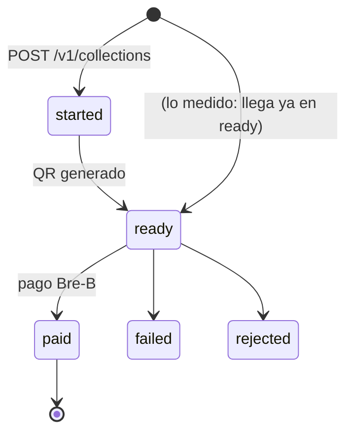
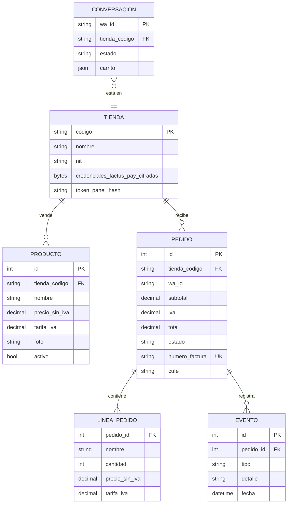

# Data Model: Firebox

**Fecha:** 2026-10-06 · **Fuente:** [spec.md](spec.md) (Key Entities) y el código en `app/firebox/`.

En la versión construida (Fases 0 y 1) **no hay base de datos propia**: las facturas viven en Factus y los cobros en Factus Pay, y
Firebox los consulta. Las entidades de abajo son objetos inmutables del código. La Fase 2 agrega persistencia (sección 3).

## 1. Entidades implementadas (en memoria)

| Entidad | Módulo | Campos | Reglas |
| --- | --- | --- | --- |
| `Linea` | `dinero.py` | referencia, nombre, cantidad (int), precio_sin_iva (`Decimal`), tarifa_iva (`Decimal` o `None` = excluido) | base = precio × cantidad redondeado half-even; IVA por línea; excluida no suma IVA ni base gravable |
| `Totales` | `dinero.py` | subtotal, base_gravable, iva, total | total = subtotal + iva; todo `Decimal` a 2 decimales |
| `FacturaEmitida` | `facturacion/factus.py` | numero, cufe, total, validada, notificaciones, crudo | `total` se compara contra `Totales.total` antes de cobrar |
| `Recaudo` | `pagos/factus_pay.py` | referencia (= número de factura), monto, estado (`started`/`ready`/`paid`/`failed`/`rejected`), qr_png | monto entre 10.000 y 12.000.000 COP |
| `Venta` | `ventas.py` | tienda, factura, recaudo, documento (ruta del PDF único) | resultado de `vender()`; entrada de `vigilar()` |
| `Fila` | `web.py` | referencia, monto, estado, clase, fecha, cufe, validada, iva, cliente, url | una por recaudo, completada con el detalle de Factus |
| `Resumen` | `web.py` | ventas, facturado, cobrado, pendiente, iva, pagadas, por_cobrar; `tasa_cobro`, `ticket_promedio` | sumas con `Decimal`; tasa y ticket con redondeo half-even |

### Estados del cobro (Factus Pay → panel)

| Estado Factus Pay | En el panel | Cuenta en |
| --- | --- | --- |
| `paid` | Pagado | Cobrado |
| `ready`, `started` | Esperando pago / Creando QR | Por cobrar |
| `failed`, `rejected` | Fallido / Rechazado | (ninguno) |

## 2. Datos externos que se leen

| Sistema | Dato | Uso |
| --- | --- | --- |
| Factus v2 `GET /v2/bills/{n}` | `cufe`, `is_validated`, `validated_at`, `totals.tax_amount`, `customer.names`, `links.public_url` | Fila del panel, IVA facturado, fecha real |
| Factus Pay `GET /v1/collections` | `reference_code`, `amount`, `status`, `qr` | Tabla y métricas del panel |
| Meta `GET /{phone_number_id}` | `display_phone_number`, `status`, `platform_type`, `name_status` | Tarjeta de conexiones |

## 3. Modelo persistente planificado (Fase 2)

Claves que sostienen la idempotencia en Fase 2: `MENSAJE_PROCESADO.id` (id del mensaje de Meta), `PEDIDO.numero_factura`,
`TIENDA.codigo`.
