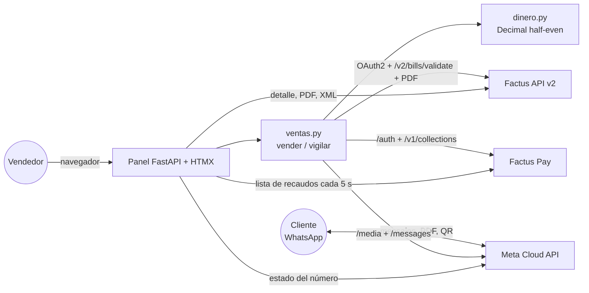
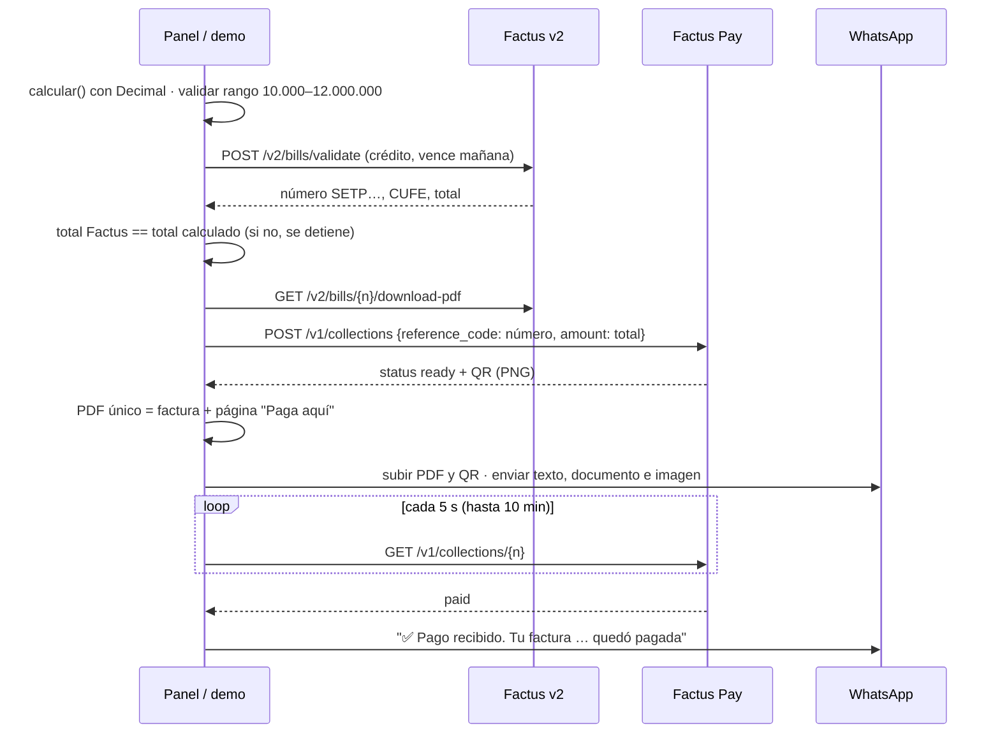

# Implementation Plan: Firebox - tienda en WhatsApp con factura electrónica y QR de pago

**Branch:** `main` · **Date:** 2026-10-06 · **Spec:** [spec.md](spec.md) · **Constitución:** `.specify/memory/constitution.md` v1.1.0
**Estado:** Fases 0 y 1 construidas, probadas y desplegadas en local; Fase 2 planificada (ver [tasks.md](tasks.md)).

## Summary

Firebox convierte una compra en WhatsApp en una **factura electrónica validada ante la DIAN (Factus API v2)** con su **cobro por QR
Bre-B (Factus Pay)** dentro del mismo PDF, la envía por la **API oficial de WhatsApp (Meta Cloud API)**, vigila el pago y confirma por
el mismo chat. Un **panel del vendedor** muestra las ventas en vivo con métricas y acciones sobre cada factura. Enfoque técnico: un solo
servicio Python que orquesta las tres APIs; el dinero se calcula con `Decimal` y redondeo bancario; la fuente de verdad de facturas y
cobros son Factus y Factus Pay (no se duplican en una base propia en esta versión).

## Technical Context

| Tema | Decisión |
| --- | --- |
| Lenguaje | Python 3.13 |
| Dependencias | FastAPI, Uvicorn, Jinja2, HTMX 2 (CDN), httpx, pypdf, reportlab, python-multipart, pytest |
| Almacenamiento | Ninguno propio en v1: facturas en Factus, recaudos en Factus Pay; caché en memoria del detalle de cada factura validada (inmutable) |
| Pruebas | pytest + `httpx.MockTransport` (Factus Pay simulado) + `fastapi.testclient`; control negativo obligatorio (Constitución V) |
| Plataforma | Windows/Linux; servidor local `127.0.0.1:8800`; número de WhatsApp registrado en Cloud API (Graph v25.0) |
| Tipo de proyecto | Servicio web único (API + panel + orquestación) |
| Metas de desempeño | SC-002 ≤ 15 s de confirmar a recibir PDF+QR; SC-003 ≤ 10 s de pago a confirmación |
| Restricciones | Factus: `User-Agent` propio obligatorio; 80 req/min · Factus Pay: `/auth` 5/min y **cada /auth invalida el token anterior**; monto 10.000–12.000.000 COP · WhatsApp: ventana de 24 h, sin plantillas |
| Escala | Demo de hackathon: una tienda de ejemplo (Relojes NovaMarket), decenas de ventas |

## Constitution Check

| Principio | Cómo se cumple | Estado |
| --- | --- | --- |
| I. El dinero lo calcula el código | `firebox/dinero.py`: `Decimal`, `ROUND_HALF_EVEN`, IVA por línea; `ventas.py` detiene la venta si el total de Factus ≠ calculado | ✅ |
| II. Una sola fuente de verdad | Un solo servicio (`firebox/web.py`) habla con Factus, Factus Pay y Meta; el panel usa las mismas funciones | ✅ |
| III. Secretos solo en el servidor | `.env` ignorado por git; el panel nunca recibe tokens; clave del panel por HTTP Basic | ✅ |
| IV. Idempotencia | Referencia del recaudo = número de factura (Factus Pay devuelve el mismo recaudo si se repite); `reference_code` único por venta en Factus | ✅ (falta dedupe de webhooks: Fase 2) |
| V. Control negativo | 7 controles negativos registrados en [tasks.md](tasks.md) | ✅ |
| VI. Lo medido manda | Hallazgos con fecha en `docs/documentacion/07_Integraciones_Conexiones.md` §11 | ✅ |
| VII. Honestidad en la demo | Sandbox declarado en PDF, panel y video | ✅ |
| VIII. YAGNI | Se construyó primero el corte vertical (Fase 0) y después el panel (Fase 1) | ✅ |

## Project Structure

```text
app/
├── demo_corte_vertical.py        # venta completa desde la terminal
├── firebox/
│   ├── config.py                 # lee .env; USER_AGENT
│   ├── dinero.py                 # Linea, Totales, calcular(), redondear(), en_texto()
│   ├── ventas.py                 # vender() y vigilar(): la venta de punta a punta
│   ├── facturacion/factus.py     # ClienteFactus: token OAuth, rango, emitir, ver, PDF, XML; cuerpo_factura()
│   ├── pagos/factus_pay.py       # ClienteFactusPay: sesión única, crear/consultar/listar recaudos
│   ├── canal/whatsapp.py         # CanalWhatsApp: subir medio, texto, imagen, documento, estado del número
│   ├── documentos/pdf.py         # página "Paga aquí" + unión con el PDF de Factus
│   ├── web.py                    # FastAPI: panel, métricas, conexiones, descargas, venta de prueba
│   └── panel/plantillas/         # panel.html, _tabla.html, _conexiones.html, _actividad.html
└── tests/                        # test_dinero.py, test_panel.py, test_factus_pay.py
scripts/                          # verificar_credenciales.py, registrar_numero.py
video/                            # libretos, preparación de material y voces, composición del video
docs/documentacion/               # documentación formal + generar_pdf.py + evidencias/
```

## Arquitectura



### Flujo de una venta (implementado)



## Decisiones y hallazgos que cambiaron el diseño (medidos)

| Fecha | Hallazgo | Decisión |
| --- | --- | --- |
| 05-oct | Sin `User-Agent` propio, Factus responde 403 (Cloudflare 1010) | `USER_AGENT = "Firebox/1.0"` en todos los clientes |
| 05-oct | El sandbox v2 de Factus es compartido (23.155 facturas de otros) | `reference_code` con prefijo propio `FB-…` |
| 05-oct | Crédito + consumidor final es aceptado por Factus v2 | `payment_form: "2"`, `due_date` = mañana; respaldo de contado si hubiera 422 |
| 05-oct | Factus Pay crea el recaudo con 200 + `ready` + QR (la doc dice 201/`started`) | Se aceptan ambos; si el QR llega vacío se consulta |
| 06-oct | **Cada `/auth` de Factus Pay invalida el token anterior** | Sesión única por proceso + re-autenticación ante 401 (con prueba y control negativo) |
| 06-oct | La fecha `created_at` de Factus Pay sale fija en el sandbox | El panel usa `validated_at` de Factus |
| 06-oct | Nadie del equipo maneja Laravel | Panel en Python (Jinja2 + HTMX) dentro del mismo servicio |

## Fases

| Fase | Alcance | Estado |
| --- | --- | --- |
| 0 · Corte vertical | Venta de punta a punta: factura + QR + PDF único + WhatsApp + vigilancia + confirmación | ✅ 05-oct · evidencia `evidencias/fase0/`: factura + recaudo en 8,8 s, WhatsApp a los 17,2 s (SC-002 pide ≤ 15 s: **aún no se cumple**), confirmación 1,1 s después de detectar el pago |
| 1 · Panel del vendedor | Métricas, conexiones, filtros, PDF/XML/QR/consultar, CSV, venta de prueba, responsive (6 tamaños medidos) | ✅ 06-oct |
| 2 · Tienda conversacional | Webhook de Meta con firma, catálogo y carrito en el chat (listas y botones), multi-tienda con base de datos, registro de tiendas | ⏳ planificada (US1, US4, US6) |

## Desviaciones conscientes frente a la spec (v1)

| Requisito | Spec | Construido | Por qué / cuándo se cierra |
| --- | --- | --- | --- |
| FR-061 / FR-062 | Token por tienda y cookie firmada | HTTP Basic con una clave en `.env` | Hay una sola tienda en v1; el token por tienda llega con el registro de tiendas (Fase 2) |
| FR-040 | Token de Factus Pay guardado cifrado por tienda | Sesión única en memoria por proceso | Se midió que cada `/auth` invalida el token anterior: guardar varios tokens no sirve; se cifra al haber varias tiendas |
| FR-035 / FR-080 | Guardar factura y eventos en base de datos | Se consultan en vivo en Factus y Factus Pay | Sin base de datos en v1 (ver [data-model.md](data-model.md)) |
